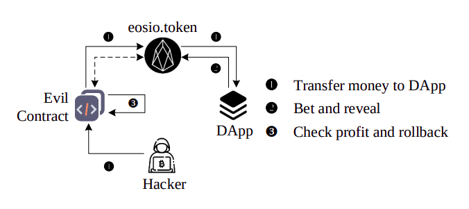

 

## Name: Unfair Rollback

### Unique Identifier: EOSIO-WCR-108

### Vulnerability Rating: Medium

### Relationship: [CWE-1021: Improper Restriction of Rendered UI Layers or Frames (Clickjacking)](https://cwe.mitre.org/data/definitions/1021.html)

 

## Background
A vulnerable smart contract that relies on users to transfer EOS before a pseudo-random outcome is revealed based on an on-chain state value like the _tapos_block_prefix_. These smart contracts contain a reveal function that is reachable from the _apply_ function (entry point) and are often used as lottery DApps where the winner is a player whose pick matches the generated pseudorandom value.

 

## Summary
An implementation of the _reveal_ function in a vulnerable DApp, where all _actions_ are *merged* into a *single transaction* when revealing the winner of the lottery. This merged reveal, allows the attacker to utilise a evil intermediate contract between the vulnerable DApp and the official _eosio.token_ contract and abuse the _revert_ operation to repeatedly revert all losing guesses, until a winning is made.

### Diagram

> **Figure 1.** Attacker exploits vulnerable DApp via evil intermediate smart contract and repeated revert

 

## Detailed Description
The attacker invokes the _transfer_ function of their evil **intermediate** contract to **forward** a genuine EOS token transfer to the vulnerable DApp and make a successful **guess** for 1 round of the lottery.

Once the tokens have successfully transferred to the victim DApp, the intermediate contract is **notified** of a token deduction by the _eosio.token_ contract within the very same transaction.

The game then completes the round, by matching the generated pseudo-random outcome to the best guess and sending the prize _(EOS tokens)_ as winnings to the elected winner _(contract)_.

The evil intermediate contract essentially checks and **tracks** the balance **before** and **after** each round of the game, triggering the _rollback_ operation unless it detects that its balance has increased _(winning guess)_ and repeats this again and again every round.

This means, for every losing round, the attacker ensures that the smart contract states and balance table is **reverted** to the original, and the losing token transfer transaction is **not** recorded on the EOS mainnet.

This _collision-like loop_ allows the attacker to _arbitrage_ the entire prize money from the vulnerable lottery DApp at statistically **insignificant** cost.
  
  

 ## Vulnerability
The **reveal** function in lottery DApps
is often used to generate a random number to determine the winner of each round. Unfortunately, many DApps implement the _reveal_ function in a way that can be exploited by the attackers. 

 

## Detection

### Steps
1. **Locate** all suspicious _reveal_
functions in the WASM file compiled from the smart contract

2. **Identify** all blocks
which contain the statement _send_inline_ to narrow down _reveal_ functions that invoke the eosio.token’s transfer function to transfer reward to the winner

3. **Extract** the _reveal_ functions that contain **modulo** calculations for random number generation using the **rem** instruction within the WASM file compiled from the EOSIO smart contract

4. **Eliminate** the reveal functions that contain **rem** instructions generated by _official_ EOSIO libraries to reduce false positives (i.e. **eoslib**)

5. **Check** the operands of the dividend in the **rem** instruction of the remaining functions to see if they are composed of any chain state variables such as **tapos_block_num**,  **current_time** or **transaction_id** and if so the smart contract is _tagged_ to have a **Unfair Rollback** vulnerability

#### EOSSAFE Evaluation Benchmark

| Total Samples | Vulnerable : Safe | Precision | Recall | F1-measure 
| ------ | ------ | ------ | ------ | ------ 
| 18 | 9 : 9 | 100.00 % | 88.89 % | 94.12 %

> **Precision** _(also called positive predictive value)_ is the fraction of relevant instances among the retrieved instances

> **Recall** _(also known as sensitivity)_ is the fraction of the total amount of relevant instances that were actually retrieved

> **F1-measure** is a measure of a test's accuracy

 

## References

- [Security Analysis of EOSIO Smart Contracts by EOSAFE](https://arxiv.org/abs/2003.06568)
