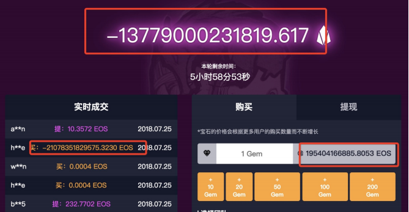

<br/>

## Name: Integer Underflow / Overflow

### Unique Identifier: EOSIO-WCR-111

### Vulnerability Rating: Critical

### Relationship: [CWE-191: Integer Underflow (Wrap or Wraparound)](https://cwe.mitre.org/data/definitions/191.html), [CWE-190: Integer Overflow or Wraparound](https://cwe.mitre.org/data/definitions/190.html)

## Background

When doing arithmetic operations, values may overflow or underflow if the boundary conditions are not checked responsibly enough, causing a loss of user's EOSIO assets.

### Summary

Common arithmetic vulnerabilities include integer overflows and integer underflows. A BatchOverflow is the name given to a smart contract vulnerability that contains an integer overflow when doing a batch transfer to multiple recipients, that is often discovered in the wild.

## Detailed Description

Integer underflows, are a vulnerability commonly caused by subtracting a large number from a small number and storing the result in an unsigned variable, making it appear to be a very large number.

An integer overflow vulnerability, on the other hand, occurs when a variable is stored in a fixed-size variable without verifying that the value is less than the maximum value that the variable can contain. If this is not the case, the value “wraps around”, allowing a very large number to appear to be a small one.

Vulnerable smart contracts are designed to send the same amount of cryptocurrency to multiple recipients. The issue with this batch overflow vulnerability is that the smart contract checks the total value to be sent and confirms it to be valid, _all at once_, by multiplying by the number of recipients and thuscreating an integer overflow, but then sends value to each recipient separately (no overflow). In this case, for a batch transfer to 4 recipients, the total value to be sent is multiplied by 4 and checked for validity.

## Vulnerability

The following EOSIO smart contract code displays a **Batch Overflow** vulnerability in the **batchtransfer** action:

```c++
typedef struct acnts {
    account_name name0;
    account_name name1;
    account_name name2;
    account_name name3;
} account_names;

void batchtransfer(symbol_name symbol, account_name from, account_names to, uint64_t balance)
{
    require_auth(from);
    account fromaccount;

    require_recipient(from);
    require_recipient(to.name0);
    require_recipient(to.name1);
    require_recipient(to.name2);
    require_recipient(to.name3);

    eosio_assert(is_balance_within_range(balance), "invalid balance");
    eosio_assert(balance > 0, "must transfer positive balance");

    uint64_t amount = balance * 4; //Multiplication overflow

    int itr = db_find_i64(_self, symbol, N(table), from);
    eosio_assert(itr >= 0, "Sub-- wrong name");
    db_get_i64(itr, &fromaccount, (account));
    eosio_assert(fromaccount.balance >= amount, "overdrawn balance");

    sub_balance(symbol, from, amount);

    add_balance(symbol, to.name0, balance);
    add_balance(symbol, to.name1, balance);
    add_balance(symbol, to.name2, balance);
    add_balance(symbol, to.name3, balance);
}
```
In the sample code above, using the **uint32_t** data type for **amount** leads to the potential overflow. Since there is a multiplication **balance * 4**, the resulting value may get larger than **2147483647** which leads to a rollover to a negative number.

For example, let's say **uint32_t amount** is **2147483647** and then **incremented by 1** as shown below:

```c++
uint32_t amount = 2147483647;
amount++;
```

The resultant value of **amount** would then be **-2147483648** as follows:
```c++
#include <iostream>
using namespace std;

int main() {
  cout << amount;
  return 0;
}
// prints uint32_t amount =  -2147483648
```

This creates a huge vulnerability in the smart contract logic, as any consequent logic checks to allow conditional monetary based actions such as the following eosio assertion:

```c++
    eosio_assert(fromaccount.balance >= amount, "overdrawn balance");
```
would pass, even if a user does not have sufficient balance. Usually the above check would prevent a use from doing an action which requires a monetary amount larger than their balance. However, in this circumstance, the user's uint32_t amount would be a negative number, so even a balance of 0 would be greater than this overflowed value, causing the condition to pass.


## Remediation

### Risk Reduction

 Avoid using **uint32_t** or even **uint64_t** to denote balances and performing arithmetic operations on EOS smart contracts as far as possible. 
 
 ### Risk Mitigation

 Use the **asset structure** defined in the eosiolib for operations rather than the exact balance which takes care of the overflow conditions.

<br/>

## Attack 

### Replication 

We can infer that the developers did not verify the results or use a secure library. The overflow is triggered by any attacker who targets the rights
management system of the game, which has the aforementioned design flaws. The attacker can exploit overflows by repeatedly calling a public withdraw function in the EOSIO smart contract

### Top Known

EOSFomo 3D, a Fomo3D18-like game based on EOS
platform required players to purchase keys on different teams, with the
last one receiving rewards from the jackpot. 

In July 2018, EOSFomo was attacked through an overflow vulnerability. 

<br/>



> **Figure 2.** As shown in the image below, the bonus displayed on the website became negative after the attack

<br/>

### Severity & Financial Impact

In this incident, over 60,686 EOS were stolen from
ordinary users.

| Attacker Account | Victim Account | Tokens Stolen | Dollars Lost  
| ------ | ------ | ------ | ------
| Unknown | Fomo3D18 | 60,686 EOS | $ 158,997.32

<br/>

## References
- [Certified Blockchain Security Professional (CBSP)](https://blockchaintrainingalliance.com/products/blockchain-security-training-on-demand)
- [A Security Case Study for Blockchain Games ](https://ieeexplore.ieee.org/document/8811555)
- [The Ultimate Guide to EOS Contract Security](https://blockgeeks.com/guides/eos-smart-contract-security/)

